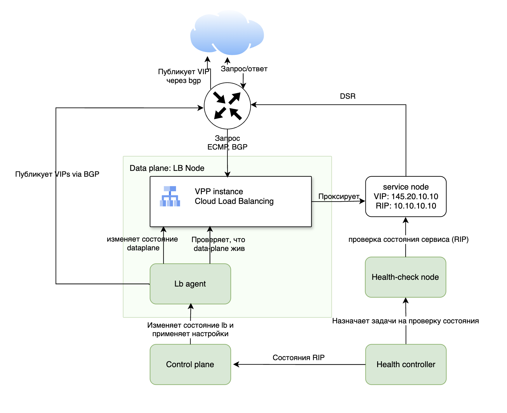

## 2 Архитектура решения

Проведённый обзор существующих систем в предыдущем разделе показал отсутствие готовых открытых решений, удовлетворяющих всем сформулированным требованиям. В текущем разделе описана архитектура разработанного балансировщика в целом, затем, в последующих разделах каждый компонент будет рассматриваться более подробно.

### 2.1 Компонентная архитектура

Разработанная система состоит из плоскости управления, системы проверок состояния и агента плоскости данных. Такое разделение повышает отказоустойчивость, поскольку выход из строя одного компонента не приводит к полной недоступности всего балансировщика.

На рисунке 1 схематично представлена архитектура системы и взаимодействие её компонентов.

Плоскость управления (control plane) централизованно хранит конфигурацию балансировщика и распределяет её по узлам плоскости данных. Она включает API-сервер для приёма запросов, реестр для хранения состояния и планировщик для размещения целевых групп по узлам. Таким образом плоскость управления отвечает за хранение и формирование желаемого состояния системы.

Система проверок состояния (health check node и health controller) выполняет активный опрос эндпоинтов и определяет их работоспособность. Она построена как децентрализованный кластер без единой точки отказа. Множество узлов проверок координируются через gossip-протокол [10] и распределяют нагрузку через консистентное хеширование.

Наконец, агент плоскости данных (lb agent) запускается на каждом узле обработки трафика. Он получает конфигурацию для плоскости данных на узле от плоскости управления, статусы здоровья от системы проверок и приводит фактическое состояние плоскости данных к желаемому. Агенты не зависят друг от друга и работают независимо.

Можно заметить, что по структуре это тот же паттерн, что и в Kubernetes, где API-сервер хранит состояние, контроллеры принимают решения, а kubelet приводит состояние узла к желаемому. Но разработанная система не является клоном Kubernetes и предназначена для работы как в самом Kubernetes, так и в классических окружениях с виртуальными машинами.

### 2.2 Модель данных

Центральным понятием системы является целевая группа (TargetGroup). Она объединяет спецификацию балансировки, список эндпоинтов и параметры проверок состояния. Спецификация балансировки задаёт протокол (TCP или UDP), порт и виртуальный IP-адрес. Параметры проверок описывают тип проверки (TCP, HTTP или GRPC), её периодичность, таймаут и порог обнаружения отказа. Каждая целевая группа идентифицируется уникальным идентификатором и принадлежит конкретному пользователю облака.

Размещение (Placement) определяет привязку целевых групп к узлам плоскости данных. Для обеспечения отказоустойчивости каждая целевая группа размещается одновременно на нескольких узлах согласно настраиваемому фактору репликации. Размещение хранит версию конфигурации для каждого узла, что позволяет отслеживать актуальность применённой конфигурации.

Состояние узла плоскости данных (DataPlaneState) определяет его статус в системе и принимает значения alive (работоспособен), dead (недоступен), drained (выведен из эксплуатации) или unknown (неизвестен). Переходы между состояниями обрабатываются плоскостью управления с учётом задержек для предотвращения моргания.

Статус здоровья эндпоинта (EndpointStatus) принимает значения healthy и unhealthy и относится к конкретному эндпоинту в составе целевой группы. Статус определяется системой проверок состояния и доставляется агентам отдельным потоком, минующим плоскость управления. Дополнительно с каждым статусом в агенте ассоциируется поколение статусов целевой группы, которое монотонно возрастает при любом изменении здоровья хотя бы одного её эндпоинта в целевой группе и служит сигналом для запуска цикла реконсиляции агентом.

### 2.3 Паттерн реконсиляции

Ключевым архитектурным принципом, через который реализуется отказоустойчивость системы, является реконсиляция. Суть её в непрерывном приведении фактического состояния к желаемому, что обеспечивает автоматическое восстановление после сбоев без специальной обработки ошибок.

Практика применения декларативного управления в крупных распределённых системах была детально описана в работе Google о системе управления сетевой инфраструктурой Orion [11]. Авторы столкнулись с фундаментальной проблемой императивного подхода, при котором система управления напрямую манипулирует сетевыми устройствами. При этом любой временный сбой связи или перебой в работе контроллера приводит к неконсистентному состоянию, а восстановление требует сложной логики повторных попыток. В результате в Orion был реализован другой подход, при котором система управления декларирует желаемое состояние, а локальные агенты непрерывно сравнивают фактическое состояние с желаемым и устраняют расхождения.

Этот же подход лег в основу архитектуры Kubernetes [12]. API-сервер хранит желаемое состояние кластера в etcd, а встроенные контроллеры непрерывно отслеживают текущее состояние ресурсов. При обнаружении расхождения между желаемым и фактическим состоянием контроллер инициирует операции по приведению системы к целевому состоянию. На каждом узле kubelet получает список подов, которые должны быть запущены, и обеспечивает соответствие фактического состояние узла этому списку. Это обеспечивает идемпотентность операций. Повторная подача того же желаемого состояния не приводит к побочным эффектам, а восстановление после прерывания не требует специальной обработки.

В разработанной системе реконсиляция применяется на двух уровнях. Плоскость управления выполняет глобальную реконсиляцию размещения целевых групп. Планировщик отслеживает изменения в составе целевых групп и узлов плоскости данных, вычисляет оптимальное размещение и приводит фактическое распределение к желаемому. В то же время каждый агент плоскости данных выполняет локальную реконсиляцию конфигурации балансировщика. Агент непрерывно синхронизирует состояние локального балансировщика с полученной конфигурацией и учитывает актуальные статусы здоровья эндпоинтов из очереди сообщений.

Выбор реконсиляции вместо императивного управления обусловлен особенностями распределённых систем. В таких системах сетевые задержки и временные недоступности компонентов являются нормой, а не исключением. Императивные команды требуют подтверждения исполнения и сложной логики обработки ошибок при сбоях. В отличие от них реконсиляция естественным образом переживает временные недоступности. Как только связь восстанавливается, агент получает актуальное желаемое состояние и приводит к нему фактическое. Реконсиляция также упрощает восстановление после отказов агентов. Перезапущенный агент просто считывает текущее желаемое состояние из локального хранилища или через повторное подключение к плоскости управления и начинает его применять, не требуя сложной процедуры восстановления.

Детали глобальной реконсиляции рассмотрены в разделе 5.3, локальная реконсиляция агента описана в разделе 4.

### 2.4 Потоки данных

В системе можно выделить несколько ключевых потоков данных, обеспечивающих её функционирование.

Поток пользовательского трафика проходит через маршрутизатор, узлы плоскости данных и сервисные узлы. Маршрутизатор равномерно распределяет входящие соединения между доступными узлами плоскости данных. Каждый узел самостоятельно определяет целевой сервисный узел на основе хеша от 5-tuple, что гарантирует постоянство направления для всех пакетов одного соединения. Ответный трафик в режиме DSR направляется напрямую от сервисного узла к маршрутизатору, минуя плоскость данных.

Помимо пользовательского трафика есть поток управляющих данных, который идёт от плоскости управления к агентам плоскости данных. Плоскость управления отслеживает изменения в конфигурации целевых групп и их размещении, формирует различия для каждого агента и доставляет их через gRPC long-poll соединения. Агенты применяют полученные изменения к локальным экземплярам VPP и подтверждают применение.

Также есть поток данных о состоянии эндпоинтов, который доставляется к агентам напрямую, минуя плоскость управления, через цепочку CDC, подробно описанную в разделе 6.5. Такое разделение потоков позволяет агентам получать обновления статусов даже при временной недоступности плоскости управления.
