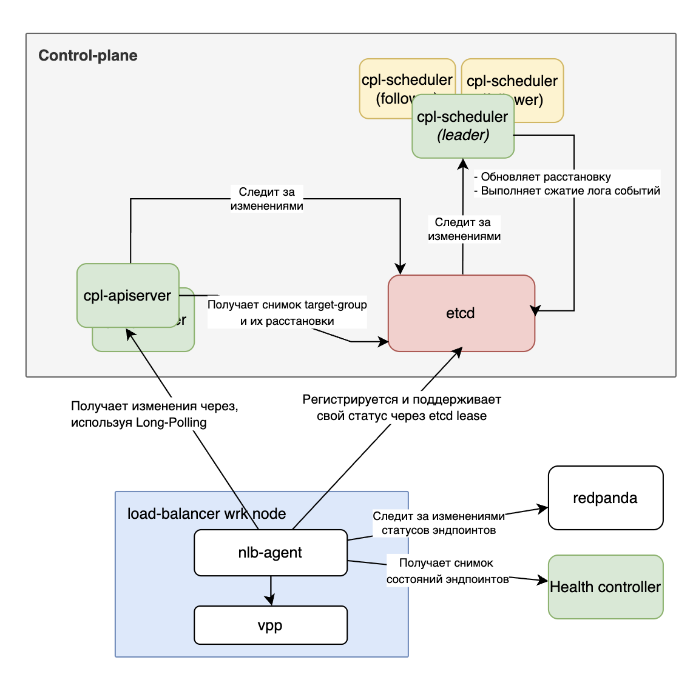

## 5 Плоскость управления

В предыдущем разделе был рассмотрен агент плоскости данных, получающий желаемое состояние извне и приводящий к нему локальный балансировщик. Настоящий раздел посвящён тому, откуда это состояние берётся. Речь идёт о плоскости управления. Этот компонент хранит конфигурацию всей системы, распределяет целевые группы по узлам и доставляет изменения агентам.

### 5.1 Обзор подходов к плоскости управления

Задача централизованного управления распределёнными компонентами хорошо изучена в индустрии. В сервисных сетках, например Istio, выделяется центральный управляющий компонент istiod, который хранит конфигурацию и доставляет её агентам (Envoy-прокси) по протоколу xDS. Протокол xDS предполагает инкрементальную доставку, при которой агент сообщает свою текущую версию ресурсов, а сервер возвращает только изменения. Аналогичная структура прослеживается в Linkerd, где destination-сервис выполняет роль централизованного источника маршрутной информации для прокси-агентов.

Помимо сервисных сеток, Kubernetes [5] реализует схожий паттерн на уровне управления рабочими нагрузками. Желаемое состояние кластера хранится в etcd, контроллеры подписываются на изменения через watch-операции и reconcile-циклом приводят фактическое состояние к желаемому. Каждый узел управляется kubelet-ом, который получает конфигурацию от API-сервера и самостоятельно применяет её локально. Для координации нескольких экземпляров контроллера используется выбор лидера через механизм аренды etcd.

Из этих систем были заимствованы несколько концептуальных решений, а именно центральное хранилище, планировщик и агенты, а также разделение желаемого и фактического состояния. При этом разработанная плоскость управления не является Kubernetes и не зависит от него. Она реализует собственную модель данных и собственный алгоритм размещения, ориентированные на задачи балансировщика, а не на управление контейнерными рабочими нагрузками.

### 5.2 Компоненты плоскости управления

На рисунке 2 схематично представлены компоненты плоскости управления и их взаимодействие с агентом плоскости данных.

В целом разработанная плоскость управления состоит из двух самостоятельных процессов и разделяемого хранилища. API-сервер (cpl-apiserver) принимает от клиентов gRPC-запросы на создание, изменение и удаление целевых групп, а также соединения от агентов для получения конфигурации. Реконсилятор (cpl-scheduler) работает как отдельный процесс, он получает события об изменениях в конфигурации и составе узлов и обновляет размещение целевых групп. Оба компонента взаимодействуют через etcd, которое служит единственным источником истины о состоянии всей системы.

Кроме постоянного хранилища, API-сервер поддерживает в памяти два кеша. Первый отражает текущее состояние узлов плоскости данных, второй хранит состояние целевых групп. Эти кеши формируются на основе watch-подписок на etcd и позволяют отвечать на запросы агентов без обращения к диску. На основе этих кешей работает система подписок, в рамках которой каждый агент, ожидающий обновлений по протоколу long-poll, регистрирует свою подписку. А она уже срабатывает при появлении изменений.

Кроме того, разделение API-сервера и реконсилятора на два процесса обусловлено соображениями отказоустойчивости. API-сервер обслуживает как входящие запросы от клиентов, так и исходящие соединения от агентов, поэтому его недоступность немедленно сказывается на доставке конфигурации. Реконсилятор же выполняет фоновые расчёты размещения и может кратковременно отсутствовать без потери конфигурации, поскольку всё необходимое уже записано в etcd. Это разделение тем более существенно, что логика планирования размещения нетривиальна, потребляет процессорное время в моменты массовых перестановок и, как любая сложная вычислительная компонента, имеет ненулевую вероятность отказа из-за необработанной ошибки или нехватки ресурсов. Изоляция этой логики в отдельном процессе гарантирует, что её падение не затронет приём клиентских запросов и доставку уже рассчитанной конфигурации. Если реконсилятор перезапускается, новый экземпляр считывает текущее состояние из etcd и продолжает работу с того момента, где остановился предыдущий.

### 5.3 Поток конфигурационных данных

Прежде всего, поток конфигурации начинается с клиентского обращения к cpl-apiserver, который записывает изменение в etcd. Реконсилятор, отслеживающий пространство ключей, реагирует на событие и при необходимости обновляет размещение, после чего API-сервер уведомляет ожидающее long-poll соединение агента. Поток статусов здоровья намеренно выведен в обход плоскости управления, что подробнее рассмотрено в разделе 6. Поток обнаружения узлов опирается на etcd-аренды. Агент создаёт аренду при старте и периодически продлевает её, а при истечении плоскость управления фиксирует выбытие узла через watch-подписку.

Такое разделение потоков не случайно. Статусы здоровья меняются значительно чаще конфигурационных событий, и направление этого потока через плоскость управления нагрузило бы её без какой-либо необходимости. Кроме того, разделение повышает независимость компонентов. Агенты получают обновления статусов даже при временной недоступности плоскости управления.

### 5.4 Хранилище состояния

Выбор хранилища для конфигурации балансировщика предопределяет возможности всей плоскости управления. Рассматривались три основных варианта и их производные, а именно реляционная база данных (PostgreSQL), хранилище типа ключ-значение с сильной согласованностью (etcd) и Redis.

PostgreSQL обладает богатой функциональностью, включая транзакции, индексы и сложные запросы, однако для данной задачи это скорее избыточность, чем преимущество. К тому же механизм реактивного оповещения LISTEN/NOTIFY значительно слабее нативных watch-операций etcd. Он не гарантирует доставки при разрыве соединения и не несёт версии изменения. Реализация аренды для обнаружения живых агентов потребовала бы отдельной логики с фоновыми задачами. А атомарный инкремент с проверкой условия (compare-and-swap) не является первоклассной операцией в PostgreSQL и реализуется через явные транзакции с уровнем изоляции SERIALIZABLE, что усложняет код и снижает производительность под нагрузкой.

В отличие от PostgreSQL, Redis не имеет проблем с реактивностью. Операции pub/sub и keyspace notifications обеспечивают своевременную доставку изменений. Однако Redis по умолчанию не гарантирует строгой линеаризуемости, поскольку при асинхронной репликации возможна потеря данных при сбое мастера. Для хранения конфигурации балансировщика, от корректности которой зависит направление трафика, это неприемлемо.

Перечисленных недостатков лишён etcd [16], разрабатывавшийся именно для хранения небольших объёмов конфигурационных данных с требованиями сильной согласованности, то есть для той же задачи, для которой Google создал Chubby [17], ставший прообразом целого класса распределённых систем координации. Kubernetes [5] использует etcd по той же причине, для хранения желаемого состояния кластера, координации контроллеров через watch-подписки и выбора лидера через аренды. На базе алгоритма Raft [18] etcd гарантирует линеаризуемые чтения и записи, что делает условные транзакции первоклассным примитивом. Транзакция etcd позволяет атомарно прочитать и изменить набор ключей при выполнении заданных условий на их текущие значения или версии (конструкция If/Then/Else). На этом примитиве строятся как простые compare-and-swap-инкременты версий конфигурации, так и более сложные операции, согласованно затрагивающие несколько ключей сразу, например одновременное обновление спецификации целевой группы и инкремент её версии в отдельном ключе. Watch-подписки уведомляют подписчиков при любом изменении, доставляя событие вместе с его "ревизией", то есть порядковым номером изменения в журнале Raft. Механизм аренды встроен нативно. Агент создаёт аренду при старте, привязывает к ней ключ своего статуса и периодически продлевает её, а при истечении ключ удаляется автоматически, что API-сервер немедленно обнаруживает через watch.

Вместе с тем etcd образует единую точку отказа для всей плоскости управления. Сам etcd спроектирован как отказоустойчивый кластер. При трёх узлах он переносит выход из строя одного, при пяти допустим отказ двух. При полной недоступности etcd агенты продолжают работать автономно на основе последнего известного состояния из локального хранилища, а трафик не прерывается. По этим причинам в качестве хранилища выбран etcd.

Что касается технической реализации, пространство ключей etcd организовано следующим образом. Спецификации целевых групп размещены по пути `spec/desired/<tgID>`, а версия последнего подтверждённого состояния хранится по пути `spec/current/<tgID>`. Эндпоинты хранятся в двух представлениях, а именно компактный снимок в `endpoints/compacted/<tgID>` и журнал изменений в `endpoints/changelog/<tgID>`. Размещения по узлам лежат в `placements/<nodeId>`, статусы узлов размещены в `statuses/<nodeId>`. Такое разделение позволяет подписываться на изменения отдельных аспектов конфигурации, не получая лишних событий.

### 5.5 Модель версионирования

Версионирование является одним из центральных механизмов плоскости управления и заслуживает отдельного рассмотрения.

Каждая целевая группа несёт две независимые версии. `SpecVersion` монотонно возрастает при каждом изменении спецификации, а именно протокола, порта или виртуального адреса. `EndpointsVersion` монотонно возрастает при каждом изменении состава эндпоинтов. Обе версии инкрементируются через compare-and-swap в etcd. Запись принимается только в том случае, если текущее значение совпадает с ожидаемым. Благодаря этому никакое параллельное изменение не может остаться незамеченным. Каждое успешное обновление строго увеличивает версию ровно на единицу.

Наряду с версиями целевой группы, версия размещения `PlacementVersion` ведётся отдельно для каждого узла плоскости данных и инкрементируется при каждом добавлении или удалении целевой группы на этом узле.

В совокупности эти версии решают несколько задач. Во-первых, они обеспечивают инкрементальную доставку конфигурации. Агент сообщает свои текущие версии, а сервер возвращает только изменения, произошедшие позже. При переподключении после длительного простоя агент получит ровно то, что пропустил, без полной перегрузки состояния. Во-вторых, версии гарантируют идемпотентность. Повторное применение конфигурации с той же версией не приводит к изменениям ни в агенте, ни в балансировщике. В-третьих, версии позволяют отслеживать отставание каждого агента. Сравнив версию, известную агенту, с текущей версией в etcd, можно точно определить, как давно данный узел получал обновления.

### 5.6 Реконсилятор

Реконсилятор отвечает за поддержание корректного размещения целевых групп по узлам плоскости данных. Он реализован как отдельный процесс, независимый от API-сервера. Такое разделение принципиально. Если реконсилятор перезапускается или временно недоступен, API-сервер продолжает принимать запросы от клиентов и доставлять конфигурацию агентам. Новые изменения накапливаются в etcd и будут обработаны реконсилятором после его восстановления.

Поскольку реконсилятор модифицирует размещения в etcd, одновременная работа нескольких его экземпляров привела бы к конкурирующим изменениям. Для исключения этого используется выбор лидера через аренду etcd. Только тот экземпляр, которому удалось захватить аренду, выполняет реконсиляцию. Остальные ожидают в режиме горячего резерва и перехватывают аренду при истечении срока у лидера. Задержка переключения определяется длиной аренды и составляет несколько секунд, что вполне приемлемо для фонового процесса, не лежащего на критическом пути трафика.

Помимо управления экземплярами, реконсиляция запускается по событиям. Реконсилятор подписывается на изменения в пространстве ключей etcd и реагирует на три класса событий, а именно появление или изменение целевой группы, изменение статуса узла плоскости данных, а также периодический таймер для принудительной полной проверки. Благодаря событийной модели реконсилятор не выполняет периодических опросов состояния. Он пробуждается ровно тогда, когда это необходимо.

События об отказе узла обрабатываются иначе. Если узел прекратил продлевать аренду etcd, его ключ статуса удаляется и реконсилятор получает соответствующее событие. Однако немедленная реакция нежелательна. Кратковременный сбой сети или перезапуск агента не должны приводить к масштабному перераспределению целевых групп. Поэтому событие о смерти узла обрабатывается с настраиваемой задержкой `nodeDeathEventDelay`. Если за это время узел восстановился и снова зарегистрировался в etcd, событие отбрасывается без каких-либо изменений в размещении. Такой механизм существенно снижает количество лишних перемещений при кратковременных нестабильностях.

### 5.7 Алгоритм размещения целевых групп

Алгоритм размещения решает задачу распределения целевых групп по живым узлам плоскости данных с соблюдением фактора репликации. Каждая целевая группа должна быть размещена ровно на заданном числе узлов, а нагрузка между узлами должна быть примерно одинаковой. При этом необходимо минимизировать число перемещений. Каждое перемещение целевой группы на новый узел влечёт инкремент версии размещения и последующую реконсиляцию на агенте, что создаёт дополнительную нагрузку на систему.

Алгоритм работает в два шага. На первом шаге обрабатываются случаи недореплицированности. Целевые группы, у которых число живых размещений меньше фактора репликации, например из-за отказа узла, распределяются на случайно выбранные живые узлы до восстановления требуемого числа копий. На этом шаге применяется жадная стратегия отбора. Задача состоит в том, чтобы как можно быстрее восстановить отказоустойчивость, а не добиться идеального баланса нагрузки.

Второй шаг выравнивает нагрузку между узлами. Вычисляется целевое число целевых групп на узел, после чего применяется алгоритм двух указателей. Узлы сортируются по текущей нагрузке, и целевые группы перемещаются от наиболее нагруженных к наименее нагруженным до достижения баланса. При равной нагрузке порядок узлов определяется детерминированно по их идентификатору, что обеспечивает воспроизводимость результата при одинаковом входном состоянии. Перемещение выполняется только в том случае, если целевая группа ещё не присутствует на узле-получателе, что исключает возникновение дубликатов.

Минимизация перемещений нужна не только из соображений нагрузки. Любое перемещение целевой группы между узлами означает, что в течение интервала между удалением её с одного узла и применением на другом группа фактически размещена на меньшем числе узлов, чем требует фактор репликации. В этот короткий промежуток устойчивость к отказу одного из оставшихся узлов снижена. Кроме того, перенос группы между узлами плоскости данных перенаправляет часть клиентского трафика на новый узел, что для активных TCP-соединений увеличивает шанс их обрыва, так как на новом узле не будет актуальной таблицы соединений (для длительных соединений узел, выбранный по 5-tuple хешу, может не совпасть с тем, что зафиксирован в таблице соединений прежнего узла). По этим причинам алгоритм не стремится достичь идеального распределения любой ценой. Если текущее размещение уже достаточно близко к целевому, перемещения не выполняются, и реконсилятор завершает цикл без изменений в etcd и без нагрузки на агентов.

### 5.8 Доставка конфигурации агентам

Механизм доставки конфигурации агентам построен на сочетании watch-подписок на etcd и long-poll соединений от агентов. Когда в etcd появляется изменение, затрагивающее конкретный узел плоскости данных, API-сервер получает уведомление через watch, обновляет внутренний кеш и пробуждает ожидающее соединение агента.

С точки зрения агента взаимодействие выглядит следующим образом. Агент отправляет gRPC-запрос (`StreamDataPlaneAssignments`), в котором указывает свою текущую версию размещения и версии всех известных ему целевых групп. API-сервер сравнивает эти версии с актуальным состоянием из кеша. Если изменений нет, запрос удерживается до появления новых данных или истечения таймаута. При наличии изменений сервер немедленно возвращает инкрементальное обновление с добавленными и удалёнными целевыми группами, изменениями спецификаций и списков эндпоинтов начиная с версий, известных агенту. Получив ответ, агент сразу устанавливает новое соединение, обеспечивая непрерывную доставку без периодического опроса.

Поскольку агент всегда сообщает, что именно ему уже известно, сервер формирует точный минимальный ответ. Это особенно заметно при переподключении после перезапуска агента. Вместо передачи полного состояния всех целевых групп сервер возвращает только то, что изменилось с момента последнего известного агенту состояния.

