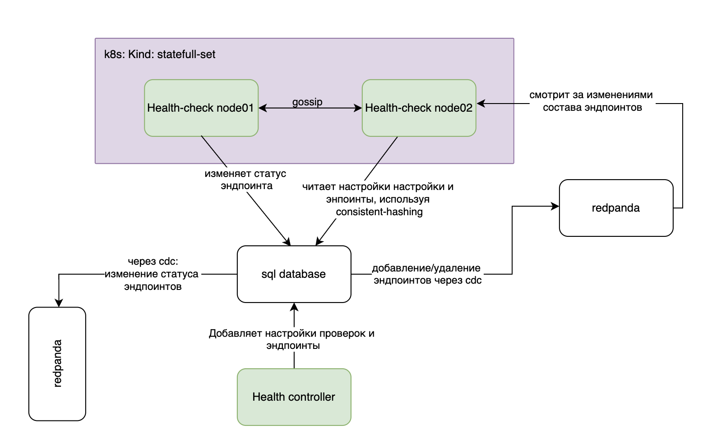

## 6 Система проверок состояния

Плоскость управления и агенты отвечают за то, чтобы конфигурация балансировщика соответствовала желаемому состоянию, однако сам по себе этот механизм ничего не знает о том, работоспособны ли серверы, к которым направляется трафик. Для решения этой задачи в архитектуре системы выделен отдельный компонент, далее называемый системой проверок состояния. Её назначение состоит в активном опросе серверов обработки трафика и своевременном информировании агентов об изменениях их доступности. В настоящем разделе описаны архитектура этой системы, алгоритм распределения проверок между узлами и механизм доставки результатов.

### 6.1 Существующие подходы и их ограничения

Задача мониторинга работоспособности серверов за балансировщиком не нова, и прежде чем приступить к проектированию собственного решения, были рассмотрены доступные подходы.

Пассивные проверки, применяемые в Envoy [19] под названием outlier detection, анализируют реальный трафик, и если доля ошибок у конкретного сервера превышает порог, он временно исключается из балансировки. Такой подход не требует отдельной инфраструктуры и хорошо работает в L7-окружениях. В архитектуре с DSR он принципиально неприменим, поскольку ответный трафик минует балансировщик и тот физически не видит ответов.

Помимо пассивных, активные проверки в сервисных сетках, например механизм health checking в Envoy, опрашивают серверы самостоятельно и не зависят от трафика. Они вполне применимы, однако несут накладные расходы полного HTTP-стека, избыточные для простой TCP-достижимости. Встроенные механизмы сервисных сеток к тому же ориентированы на собственную экосистему и сложно интегрируются с произвольной инфраструктурой.

Особняком стоит подход Consul [20], реализующий децентрализованную проверку состояния с координацией через gossip-протокол. Подход с gossip-координацией был признан перспективным, однако Consul как готовое решение требует присутствия агента на каждом проверяемом узле, что не всегда возможно в облачной среде. Кроме того, он вносит внешнюю зависимость со своей моделью данных и операционными требованиями.

Исходя из вышесказанного, готового решения, удовлетворяющего всем требованиям, обнаружено не было.

### 6.2 Архитектура системы проверок

На рисунке 3 схематично представлена архитектура системы проверок состояния и взаимодействие её компонентов.

Система проверок развёртывается как кластер равноправных узлов без выделенного лидера. Каждый узел самостоятельно выполняет проверки серверов, закреплённых за ним алгоритмом распределения. Выход из строя любого узла не нарушает работу кластера, поскольку его проверки перераспределяются между оставшимися участниками.

Узлы системы развёртываются как StatefulSet в Kubernetes. Выбор StatefulSet обусловлен требованием стабильных сетевых имён, поскольку gossip-протокол использует заранее известные адреса для начального подключения к кластеру, а предсказуемые DNS-имена упрощают конфигурацию начального списка узлов. Каждый узел получает уникальный идентификатор из имени пода.

Для координации членства в кластере был выбран протокол SWIM [10], реализованный библиотекой hashicorp/memberlist [21]. Выбор именно SWIM, а не механизма Kubernetes API или etcd обусловлен тремя соображениями. Во-первых, скорость. SWIM обнаруживает сбои через прямые опросы между узлами, тогда как Kubernetes API добавляет несколько промежуточных хопов между фактом сбоя и получением события. Во-вторых, независимость. При опросе через Kubernetes API доступность обнаружения сбоев определяется доступностью API-сервера. SWIM же работает до тех пор, пока узлы HC-кластера могут взаимодействовать между собой, и не завязан ни на etcd, ни на Kubernetes. В-третьих, переносимость. Использование SWIM позволяет развернуть систему проверок как вне Kubernetes, так и внутри него без изменений в протоколе координации. Описание самого механизма обнаружения сбоев приводится в оригинальной статье [10], а интервалы опроса и таймауты настраиваются через переменные окружения.

### 6.3 Распределение проверок между узлами

Центральная задача алгоритма распределения состоит в том, чтобы равномерно закрепить серверы обработки трафика за узлами проверок и корректно перераспределить их при изменении состава кластера. Простейшим решением было бы напрямую отобразить сервер на узел проверок одним консистентным хешированием. Однако число проверяемых целей на порядки превышает число узлов проверок, и при каждом изменении состава кластера хеш пришлось бы заново вычислять для каждой цели в системе. Стоимость ребаланса оказалась бы пропорциональна общему числу целей, а не числу изменившихся узлов. По этой причине от одноуровневой схемы пришлось отказаться.

Вместо этого реализована двухуровневая схема, аналогичная по устройству тому, как Cassandra [22] распределяет данные между узлами. Cassandra помещает физический узел на несколько позиций кольца посредством виртуальных узлов, и данные сначала отображаются на позицию кольца, а затем на ближайший виртуальный узел. При выходе физического узла из строя перераспределяются только его виртуальные узлы, а не весь массив данных. В разработанной системе применяется та же логика. На первом уровне каждая проверяемая цель отображается на виртуальный шард, на втором уровне виртуальный шард закрепляется за несколькими узлами проверок в соответствии с настраиваемым фактором репликации.

Закрепление цели за виртуальным шардом вычисляется один раз и может сохраняться в базе данных вместе с самой целью. При изменении состава кластера это закрепление остаётся прежним, заново вычисляется только распределение виртуальных шардов между узлами проверок. Узел, принимающий новые шарды, выбирает соответствующие цели из базы данных одним запросом по списку шардов, не обращаясь к хеш-функции для каждой цели в отдельности. Объём ребаланса определяется числом перераспределяемых шардов, а не общим числом проверяемых целей.

Число виртуальных шардов фиксируется при запуске приложения и значительно превышает число узлов проверок. Поэтому при изменении состава кластера перераспределению подлежат только шарды, принадлежавшие изменившемуся узлу, что соответствует поведению Cassandra при добавлении или удалении физического узла. Репликация проверок означает, что каждая цель опрашивается несколькими узлами одновременно. Если один из них теряет связность с конкретным сервером, остальные реплики продолжают проверки и фиксируют корректный статус.

Для реализации консистентного хеширования поддерживаются два алгоритма. Классический вариант строит хеш-кольцо с настраиваемым числом виртуальных узлов на каждый физический. Альтернативой служит алгоритм dxhash, обеспечивающий равномерное распределение без дополнительной настройки числа виртуальных узлов, поскольку равномерность достигается за счёт конструкции самого алгоритма. На практике dxhash проще в конфигурации, поскольку исключает необходимость подбора параметров для достижения баланса.

### 6.4 Реакция на события членства

При присоединении нового узла в кластер узлов проверок, часть виртуальных шардов перераспределяется на новый узел, снижая нагрузку на остальных участников. Этот узел принимает шарды, загружает соответствующие цели из базы данных и начинает проверки.

При переходе узла в состояние подозреваемого, ещё до окончательного объявления о выбывании или смерти, соседи заблаговременно принимают его виртуальные шарды. Это упреждающее перераспределение сокращает разрыв между фактическим сбоем узла и полным перехватом его проверок, что напрямую влияет на скорость реакции системы на изменение доступности серверов.

При объявлении узла выбывшим или умершим происходит окончательное переназначение шардов, и опросы возобновляются уже новыми владельцами.

### 6.5 Хранение и доставка результатов

Хранилище для результатов проверок должно удовлетворять одновременно нескольким требованиям. Во-первых, оно принимает поток обновлений, частота которого пропорциональна произведению числа эндпоинтов на обратную величину интервала проверок и на боевых нагрузках на порядки превышает частоту изменений собственно конфигурации балансировщика. Во-вторых, узел проверок состояния при перебалансировке должен одной операцией выбрать все цели, относящиеся к закреплённым за ним виртуальным шардам, а не обходить хранилище поэлементно. В-третьих, поток изменений нужно надёжно довести до агентов, не дублируя его через плоскость управления и не пропуская сообщений.

Этим требованиям удовлетворяет связка PostgreSQL [23] и Debezium [24]. PostgreSQL даёт реляционную модель с индексом по идентификатору виртуального шарда, что позволяет узлу проверок при изменении состава кластера выбрать все свои цели одним диапазонным запросом. Debezium считывает журнал упреждающей записи (WAL) PostgreSQL и публикует каждое изменение строки в Redpanda [25], гарантируя at-least-once-доставку без необходимости реализовывать обнаружение пропусков на стороне приложения. Альтернативный вариант с использованием etcd рассматривался и был отвергнут. Пространство ключей etcd отведено под конфигурацию с относительно редкими изменениями, а не под поток мониторинга, и хранилище не предоставляет ни эффективного выбора по диапазону произвольного атрибута, ни WAL-based CDC. Чтение etcd напрямую агентами антипаттернично, поскольку нагружает кластер координации трафиком, не связанным с конфигурацией; проксирование же тех же данных через плоскость управления потребовало бы её участия в обработке потока статусов, что нагрузило бы её без какой-либо необходимости и противоречит общему принципу разделения потоков, описанному в разделе 5.3.

Поток статусов идёт к агентам напрямую, в обход плоскости управления. Это сделано намеренно, поскольку статусы здоровья серверов меняются с высокой частотой, и направление этого потока через плоскость управления нагрузило бы её без какой-либо необходимости. Помимо разгрузки, разделение потоков повышает отказоустойчивость системы, поскольку агенты получают обновления статусов даже при временной недоступности плоскости управления.

В качестве брокера выбран Redpanda по нескольким причинам. Redpanda реализует API, совместимый с Apache Kafka [26], что позволяет использовать стандартные клиентские библиотеки. В отличие от Apache Kafka, Redpanda написан на C++ и не требует ни JVM, ни ZooKeeper, координация встроена в сам брокер, что сокращает число внешних зависимостей. Каждый агент потребляет сообщения с уникальным идентификатором группы, соответствующим идентификатору его узла, и таким образом получает полную копию потока статусов независимо от остальных. Подробнее взаимодействие агента с этим потоком описано в разделе 4.7.

По мере роста числа серверов PostgreSQL может стать узким местом по объёму записи. В этом случае естественным путём миграции является переход на YugabyteDB [27], распределённую SQL-базу с PostgreSQL-совместимым интерфейсом. Код приложения при этом не потребует изменений, поскольку использует стандартный драйвер. В качестве ключа шардирования для таблицы статусов целесообразно использовать хеш от пары (IP-адрес, порт), что обеспечит равномерное распределение записей. Debezium поддерживает PostgreSQL-совместимые базы, поэтому цепочка CDC также останется без изменений. В текущем масштабе системы одиночного экземпляра PostgreSQL достаточно, поэтому данный вариант рассматривается как путь эволюции.

### 6.6 Управление списком проверяемых целей

Система проверок получает информацию о том, какие серверы опрашивать, от плоскости управления. При добавлении сервера в целевую группу плоскость управления уведомляет кластер проверок, который включает его в список активных целей и присваивает ему виртуальный шард. При удалении сервера или целевой группы проверки прекращаются.

