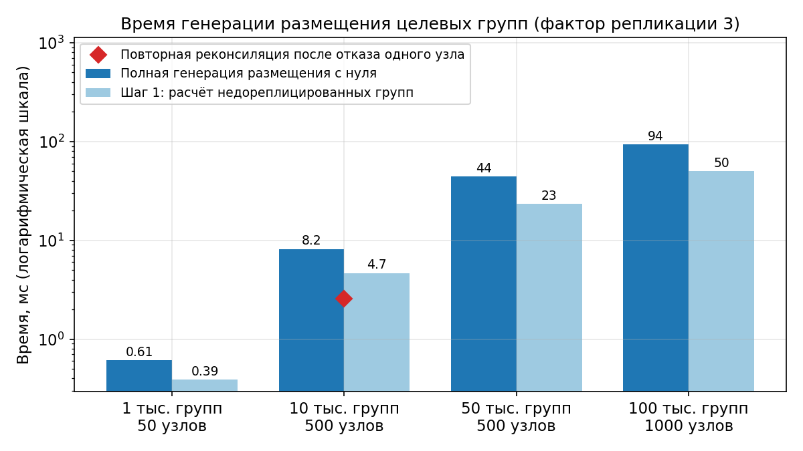
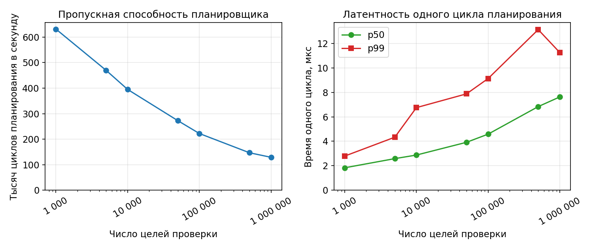

## 7 Тестирование

В данном разделе описано тестирование разработанной системы. Оно проводилось на трёх уровнях. Функциональное тестирование проверяло корректность сквозных сценариев на штатном стенде. Нагрузочное проверяло пропускную способность отдельных компонентов на изолированных бенчмарках. Хаос-тестирование проверяло поведение системы при одновременных отказах компонентов и деградации инфраструктуры. Именно для этого система и проектировалась.

### 7.1 Функциональное тестирование

Функциональное тестирование проверяло путь конфигурации от gRPC API плоскости управления до записи в VPP на узлах плоскости данных. Сценарии включали создание целевой группы, добавление и удаление эндпоинтов, изменение спецификации, удаление группы целиком и реакцию на изменение статуса здоровья.

Также была проверена логика реконсиляции. После серии операций добавления, удаления и обновления конфигурация VPP на агентах плоскости данных соответствовала желаемому состоянию из etcd. Нездоровые эндпоинты исключались из балансировки в пределах одного цикла реконсиляции после получения соответствующего статуса из Redpanda.

### 7.2 Нагрузочное тестирование

Производительность реконсилятора плоскости управления проверялась микробенчмарками, измерявшими время генерации размещения в отрыве от обращений к etcd. Полная генерация размещения с нуля для 10 000 целевых групп по 500 узлам плоскости данных занимала около 8 миллисекунд, для 100 000 групп по 1000 узлам не превышала 110 миллисекунд, а повторная реконсиляция после отказа одного узла в сбалансированном кластере из 500 узлов укладывалась примерно в 3 миллисекунды, поскольку перестраивается лишь часть размещения. Результаты измерений для четырёх масштабов кластера приведены на рисунке 4. Видно, что время растёт примерно линейно с числом целевых групп, а около половины его приходится на первый шаг алгоритма, расчёт недореплицированных групп. Это подтверждает применимость двухшагового алгоритма из раздела 5.7 на масштабах реального облачного провайдера.

Планировщик системы проверок состояния был проверен отдельным микробенчмарком, изолирующим логику планирования от выполнения самих проверок. На одном узле планировщик выполнял от 129 тысяч до 631 тысячи циклов планирования в секунду в зависимости от числа обслуживаемых целей от 1 миллиона до 1 тысячи, а время одного цикла оставалось на уровне единиц микросекунд. При 100 000 целей оно составляло 4,6 микросекунды по p50 и 9,1 по p99. Зависимость пропускной способности и латентности цикла от числа целей приведена на рисунке 5. Рост латентности с числом целей остаётся логарифмическим, что соответствует устройству планировщика на основе двоичной кучи. Таким образом, сама по себе диспетчеризация проверок на несколько порядков дешевле минимального интервала проверок в одну секунду. Под реальной нагрузкой, когда каждая проверка выполняет сетевой запрос, узким местом оказывается не планировщик, а стандартный сетевой стек ядра Linux. Время уходит на системные вызовы создания сокетов и последующей обработки пакетов, а не на логику планирования. Это согласуется с публичными описаниями инструментов этого класса. Так, доклад Яндекса о собственной системе проверок состояния [7] тоже называет именно обработку пакетов в ядре ограничивающим фактором. Это наводит на мысли об обходе части сетевого стека Linux с помощью eBPF и AF_XDP [28]. Более точная локализация и снятие этого предела отнесены к направлениям дальнейшей работы.

### 7.3 Хаос-тестирование, методология

Для распределённой системы функционального и нагрузочного тестирования недостаточно. К отказоустойчивости в настоящей работе предъявляется значительное число требований, поэтому проверка поведения системы при одновременных сбоях занимает в тестировании центральное место. В реальности сбои могут происходить не по одному, иногда одновременно ломается сразу несколько компонентов, а сеть деградирует. Перебрать такие комбинации сбоев вручную в принципе возможно, однако обеспечить воспроизводимость такого перебора уже существенно сложнее, а без воспроизводимости теряется возможность сравнивать поведение разных версий системы под одним и тем же сценарием.

Прежде чем описывать сами сценарии отказов, необходимо ввести два инструмента, на которых строятся измерения. Тестовый сервер представляет собой обычное HTTP-приложение, развёрнутое за виртуальным IP-адресом балансировщика. Оно отвечает на запросы балансировщика, на проверки состояния и на пользовательский трафик. С точки зрения системы это рядовой сервер обработки, ничем не отличающийся от реальной нагрузки. В свою очередь тестовый клиент — это многопоточный генератор HTTP-нагрузки, обращающийся к виртуальному IP с настраиваемой частотой и параллелизмом. Он не привязан ни к одному конкретному серверу и пользуется ровно теми же путями балансировки, что и обычное клиентское приложение в облаке. Благодаря этому метрики, собранные на стороне тестового клиента, отражают поведение системы именно с точки зрения её конечного пользователя, что делает их пригодными для оценки SLO в условиях отказов.

Для собственно применения отказов используется Chaos Mesh [29], платформа, в которой отдельные воздействия описываются YAML-манифестами и собираются в единый сценарий эксперимента, применяемый к Kubernetes-стенду. Выбор обусловлен двумя соображениями. Во-первых, декларативное описание сценария фиксирует траекторию отказов, то есть их последовательность, длительности, правила выбора поражённых компонентов, доли поражения и паузы между фазами. Это позволяет применять один и тот же сценарий к разным версиям системы и сравнивать поведение под идентичной траекторией. Подобное сравнение использовалось в работе для оценки эффекта точечных изменений в плоскости управления, например задержки обработки события смерти узла. При той же траектории отказов меняется поведение системы в начальных фазах, тогда как в фазе тотального хаоса основной нагрузкой остаётся перераспределение виртуальных шардов в кластере проверок. Без зафиксированной траектории такое сравнение опиралось бы на доверие к усреднённым метрикам, а не на сопоставление одних и тех же интервалов времени. Во-вторых, Chaos Mesh покрывает все нужные типы воздействий, а именно убийство пода, продолжительный отказ пода, ограничение процессорных и оперативных ресурсов, сетевые задержки, потери пакетов, разделения сети и DNS-ошибки. Реализация аналогичного набора вручную потребовала бы существенно больших усилий без выигрыша в воспроизводимости.

У применённой методики есть ограничение, которое влияет на интерпретацию результатов. Chaos Mesh не предоставляет способа зафиксировать конкретный набор подов, отбираемых под воздействие при заданной доле поражения и случайном выборе процента. Поэтому фиксируется только траектория отказов по классам компонентов, но не конкретные имена подов, на которые отказ приходится. Для сравнительных и оценочных целей этого достаточно. Усреднение по серии повторных прогонов даёт сопоставимые значения метрик. Строгий регрессионный анализ потребовал бы доработки самого инструмента.

Сами сценарии отказов организованы в четыре фазы нарастающей сложности. Первая фаза проверяет реакцию на отказ одного класса компонентов. В её состав входят сценарии убийства 75% узлов проверки состояний, отказа 50% агентов плоскости данных, убийства контейнеров тестовых серверов, выхода из строя реконсилятора плоскости управления, задержки 200 мс до etcd и других инфраструктурных компонентов, сетевого разделения длительностью 30 секунд, а также повышенной процессорной нагрузки на агенты (порядка 60% на двух ядрах) и нагрузки на оперативную память узлов проверки состояний (порядка 256 МБ). При отказе пода агента одновременно с ним прекращает работу и плоскость данных соответствующего узла, поскольку тестовая реализация плоскости данных размещается в том же процессе. Это нужно учитывать при интерпретации клиентских ошибок в соответствующих сценариях.

Вторая фаза комбинирует два типа сбоя одновременно. В её состав входят сценарии одновременного отказа узлов проверки состояний и тестовых серверов, одновременного отказа агента плоскости данных и реконсилятора плоскости управления, отказа узлов проверки состояний с потерями 30% в gossip-канале, задержки CDC 500 мс совместно с отказом тестовых серверов и аналогичные пары.

Третья фаза комбинирует три типа сбоя. Сюда входят сценарии одновременного отказа узлов проверки состояний, тестовых серверов и агентов, отказа агента и реконсилятора плоскости управления вместе с инфраструктурными задержками до 300 мс, а также потерь в gossip-канале до 35% совместно с отказом узлов проверки состояний и задержками CDC.

На четвёртой фазе одновременно применяются 75% отказ узлов проверки состояний, 40% потерь в gossip-канале, 50% отказ тестовых серверов, 40% отказ агентов плоскости данных, отказ плоскости управления, инфраструктурная задержка свыше 400 мс и DNS-ошибки при обнаружении сервисов.

Между сценариями выдерживался интервал в 20 секунд для возврата затронутых подов в готовность. Между фазами выдерживалась пауза 45 секунд для полной стабилизации системы. Эти значения выбраны с большим запасом по результатам первичных измерений.

### 7.4 Тестовый стенд

Тестирование проводилось на Kubernetes-кластере, содержащем 2 API-сервера плоскости управления, 2 реконсилятора плоскости управления (один лидер, один в горячем резерве через etcd-аренду), 2 API-сервера системы проверок состояния, 4 узла проверки состояний (развёрнутые как StatefulSet), 4 агента плоскости данных, 16 тестовых серверов (StatefulSet с anti-affinity по узлам) и 2 тестовых клиента.

Параметры компонентов выбраны следующим образом. Фактор репликации проверок состояния равен 2, интервал проверок 3 секунды, порог обнаружения отказа 2 последовательных неуспешных проверки. Фактор репликации целевых групп равен 4. Каждый тестовый клиент генерировал постоянный поток в 25 запросов в секунду через VIP балансировщика, итого около 50 запросов в секунду суммарной нагрузки.

На рисунке 6 представлена панель мониторинга Grafana во время одного из хаос-прогонов. Верхняя полоса отражает доступность компонентов, и на ней видно, как одновременно проседают доступности узлов проверки состояний, агентов плоскости данных и тестовых серверов, а также периодически отказывают компоненты плоскости управления. Несмотря на это, частота ошибок клиентского трафика через VIP остаётся низкой и возвращается к нулю между всплесками, а интервал покрытия проверок состояния удерживается в штатной полосе. Подробный разбор этих метрик приведён в разделах 7.5 и 7.6.

### 7.5 Метрики

Главной метрикой работоспособности системы в целом служит частота ошибок клиентского трафика `testclient_request_errors_total{kind}`, измеренная на стороне тестового клиента. Разработанная система задумывалась как балансировщик нагрузки, и именно отсутствие ошибок у клиентов отражает выполнение её прямой задачи. Внутренние сбои отдельных компонентов имеют значение лишь постольку, поскольку они приводят к ошибкам у конечного пользователя. Если ошибок нет для пользователя, то можно утверждать, что система работает корректно, какие бы перестроения ни происходили внутри. Разбивка по типу (`timeout`, `refused`, `eof`, `dns`, `other`) позволяет различать классы проблемы, а парная метрика `testclient_requests_total{served_by}` показывает распределение запросов по конкретным серверам и используется для оценки равномерности балансировки.

Главной метрикой системы проверок состояния служит интервал между последовательными запросами проверки к одному и тому же серверу `testserver_hc_coverage_interval_seconds`. В штатном режиме он совпадает с настроенным периодом проверок. Рост p90 означает, что сервер какое-то время оставался без активного мониторинга и его реальный статус не был известен балансировщику. Метрика собирается на стороне тестового сервера по факту приёма запроса и не зависит от внутренних счётчиков системы проверок. Поэтому она не теряет точность при отказах самого кластера, что важно для интерпретации результатов хаос-тестов.

### 7.6 Результаты

Все четыре фазы хаос-тестирования система прошла без длительных перерывов в обслуживании клиентского трафика. Основной метрикой SLO системы проверок состояния служит Coverage Interval. Его динамика показана на нижних панелях рисунка 6, где приведены линия p90 и тепловая карта распределения значений. На протяжении всего прогона, включая фазу тотального хаоса, p90 удерживается в полосе 2–3 секунды. Единичные пики до 10 секунд приходятся на моменты массового перераспределения виртуальных шардов между узлами проверки состояний и возвращаются к норме за один-два цикла проверок.

Тот же вывод подтверждается агрегацией по всем прогонам серии, представленной на рисунке 7. На нём интервал покрытия p90 приведён отдельно для каждого сценария, дающего клиентский эффект, а также для изолированных отказов кластера проверок состояния, продолжительного отказа подов и нагрузки на оперативную память. Во всех сценариях, включая фазу тотального хаоса, медиана по прогонам удерживается в полосе около 2–3 секунд и не приближается к бюджету обнаружения отказа в 9 секунд, который складывается из трёх пропущенных проверок при периоде в 3 секунды. При изолированной потере трёх из четырёх узлов проверки состояния интервал за один цикл выходит на ровный уровень около 3 секунд и далее не нарастает в течение всего отказа, что говорит о корректной работе перераспределения виртуальных шардов даже при значительном сокращении кластера.

Путь данных под хаос-нагрузкой не деградировал по времени обработки. Длительность операций VPP на агентах удерживалась на уровне около 990 мкс по p99 во всех фазах и совпадала со штатным режимом. Многослойный отказ не сказывался на скорости применения изменений в плоскости данных.

Поскольку разрабатывалась именно система балансировки нагрузки, отдельно измерялась длительность клиентского сбоя, то есть самый длинный непрерывный отрезок времени, в течение которого клиент видел ошибки. Эта величина приведена на рисунке 8 по логическим сценариям, обобщённая по серии повторных прогонов и сгруппированная по фазам хаос-тестирования. Она устойчива к редким одиночным всплескам в ходе долгого отказа и отражает реальное время восстановления балансировки с точки зрения пользователя. Значения сняты дифференцированием счётчика Prometheus с шагом выборки около 2 секунд, поэтому отрезки короче этого шага не разрешаются, а реальный перерыв в части сценариев был ещё меньше показанного. В подавляющем большинстве сценариев отрезок ошибок составляет лишь несколько секунд и возвращается к нулю за один-два шага выборки, а в наиболее тяжёлых комбинациях не превышает 12 секунд. Шесть логических сценариев не дали ни одной клиентской ошибки ни в одном прогоне. В части сценариев в отдельных прогонах отрезок ошибок не успевал закрыться до начала следующего сценария и отмечен на рисунке звёздочкой, поэтому показанная для них длительность является нижней оценкой. Сами величины при этом невелики, а наибольшие из них приходятся на фазу тотального хаоса при одновременном отказе всех классов компонентов.

При чтении этих результатов нужно учесть один технический момент. На графиках доступности компонентов часть кратких провалов сглаживается, потому что Prometheus снимает значения с шагом, а Grafana дополнительно округляет визуализацию. Реальная просадка пакетов в моменты применения хаос-сценариев была заметно глубже того, что отражено на графиках. В фазе 4 одновременно отказывали узлы проверки состояний, агенты плоскости данных, тестовые серверы и компоненты плоскости управления. Однако клиентский трафик продолжал обрабатываться, а покрытие, измеренное на стороне тестового сервера, оставалось в пределах SLO. В этом и состоит основной результат тестирования. Предложенная архитектура поглощает многослойный отказ за счёт избыточности на каждом уровне (репликация целевых групп, репликация виртуальных шардов, дублирование экземпляров плоскости управления и системы проверок состояния) и реконсиляции, восстанавливающей расхождения автоматически.

Архитектурно ожидаемые единые точки отказа подтвердились. Полная недоступность etcd ломает плоскость управления (прямое следствие выбора etcd как единственного источника истины, раздел 5.4). Цепочка PostgreSQL и Redpanda образует единую точку отказа в доставке статусов проверок (раздел 6.5). Оба случая решаются стандартными средствами, кластером etcd из 3–5 узлов и репликацией PostgreSQL. В боевой эксплуатации эти конфигурации обязательны. На тестовом стенде использовались одиночные экземпляры как достаточные для проверки логики разработанных компонентов. Их отказ выводит систему из строя предсказуемым образом, а не вскрывает дефекты архитектуры.

